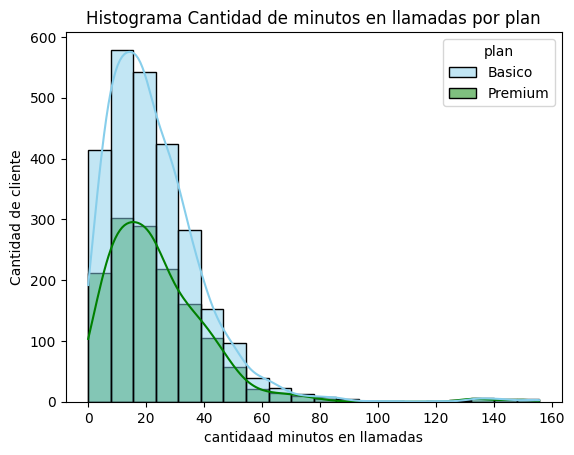
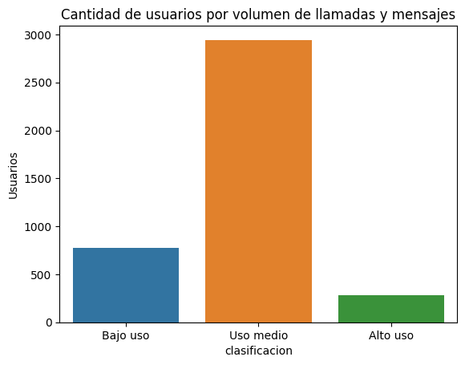

# Análisis de clientes de ConnectaTel

Análisis exploratorio del uso de los servicios móviles de 4.000 clientes de una empresa de telecomunicaciones con operación en México y Colombia. El objetivo es saber si sus dos planes, Básico y Premium, corresponden al uso real de los clientes.

**Resultado principal:** los clientes Básico y Premium consumen lo mismo, y muy por debajo de lo que incluyen sus planes. La recomendación es rediseñar la oferta.

[Ver el notebook](analisis_connectatel.ipynb) · [Abrir en Google Colab](https://colab.research.google.com/github/fvt1999pipe-eng/analisis_connectaTel/blob/main/analisis_connectatel.ipynb)

## Preguntas de negocio

1. ¿Qué calidad tienen los datos y qué hay que corregir antes de analizarlos?
2. ¿Cómo usan el servicio los clientes y qué diferencias hay entre los dos planes?
3. ¿Los valores extremos son errores de registro o clientes reales de alto consumo?
4. ¿Qué segmentos de clientes existen y qué implican para la oferta de planes?

## Resultados

| Hallazgo | Dato |
|---|---|
| Consumo del cliente típico (mediana) | 5 mensajes, 4 llamadas y 19,8 minutos |
| Minutos usados frente a minutos incluidos | 23 en promedio, frente a 100 (Básico) y 600 (Premium) |
| Diferencia de consumo entre planes | Ninguna: el patrón es el mismo, aunque Premium cuesta más del doble |
| Clientes sin una ciudad válida | 565 de 4.000 (14,1%) |
| Valores atípicos | Clientes reales de alto consumo; se conservan en el análisis |



*Minutos en llamadas por plan. Las dos distribuciones tienen la misma forma: casi todos los clientes hablan menos de 40 minutos, sin importar el plan.*



*Clientes por nivel de uso. La mayoría está en Uso medio; Alto uso es el segmento más pequeño.*

### Recomendaciones

1. Crear un plan de entrada más económico para los clientes de bajo uso.
2. Rediseñar el plan Premium para que se diferencie por valor (más GB, beneficios o servicios) y no por minutos que nadie usa.
3. Retener a los clientes Premium de bajo uso antes de que cancelen por sentir que pagan de más.
4. Ofrecer un plan intermedio o un paquete de minutos a los clientes de alto uso del plan Básico.
5. Mejorar la calidad de los datos en el origen (edad, ciudad y fechas).

## Datos

| Archivo | Filas | Contenido |
|---|---|---|
| `plans.csv` | 2 | Planes vigentes: precio mensual, minutos, mensajes y GB incluidos, y costo del consumo adicional. |
| `users_latam.csv` | 4.000 | Clientes: edad, ciudad, fecha de registro, plan y fecha de cancelación. |
| `usage.csv` | 40.000 | Uso durante 2024: tipo de registro (llamada o mensaje), fecha, duración de la llamada y longitud del mensaje. |

Los datos son un caso de estudio del bootcamp de Análisis de Datos de TripleTen y no se incluyen en el repositorio.

## Metodología

1. **Exploración:** estructura, tipos de datos y dimensiones de cada tabla.
2. **Calidad de los datos:** valores nulos, centinelas (`-999` en la edad y `?` en la ciudad) y fechas fuera de rango (año 2026).
3. **Limpieza:** reemplazo de centinelas, conversión de fechas y verificación de que los nulos de `duration` y `length` dependen del tipo de registro.
4. **Uso por cliente:** mensajes, llamadas y minutos por cliente, unidos con los datos de cada uno.
5. **Distribuciones y valores atípicos:** histogramas por plan, diagramas de caja y límites con el método IQR.
6. **Segmentación:** por nivel de uso (bajo, medio y alto) y por edad (joven, adulto y adulto mayor).
7. **Conclusiones y recomendaciones** para el negocio.

## Estructura del repositorio

```
analisis_connectaTel/
├── analisis_connectatel.ipynb   Notebook con el análisis completo
├── img/                         Gráficos usados en este README
├── requirements.txt             Librerías necesarias
└── README.md
```

## Cómo reproducir el análisis

1. Clona el repositorio e instala las librerías:

   ```bash
   git clone https://github.com/fvt1999pipe-eng/analisis_connectaTel.git
   cd analisis_connectaTel
   pip install -r requirements.txt
   ```

2. Crea una carpeta `datasets/` junto al notebook y copia en ella los tres archivos CSV.
3. Abre `analisis_connectatel.ipynb` en Jupyter y ejecuta las celdas en orden.

En Google Colab, sube los tres archivos a una carpeta `datasets/` desde el panel **Archivos** antes de ejecutar el notebook.

## Herramientas

Python · pandas · Matplotlib · Seaborn · Jupyter / Google Colab

## Autor

**Felipe Vásquez Torres**, analista de datos con experiencia en supply chain y operaciones.

[LinkedIn](https://www.linkedin.com/in/felipe-vasquez-torres) · [Portafolio](https://fvt1999pipe-eng.github.io) · fe.vasquez.t@gmail.com
